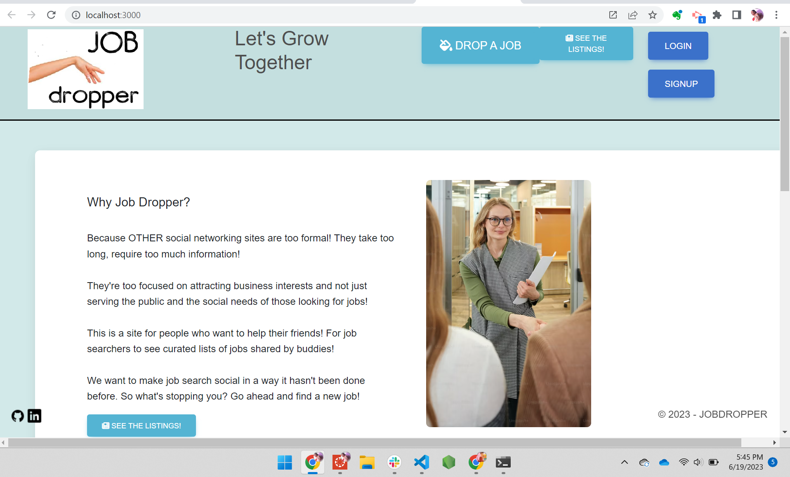
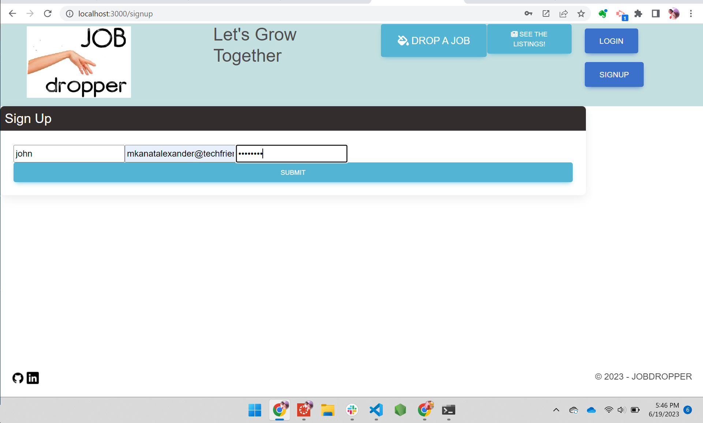
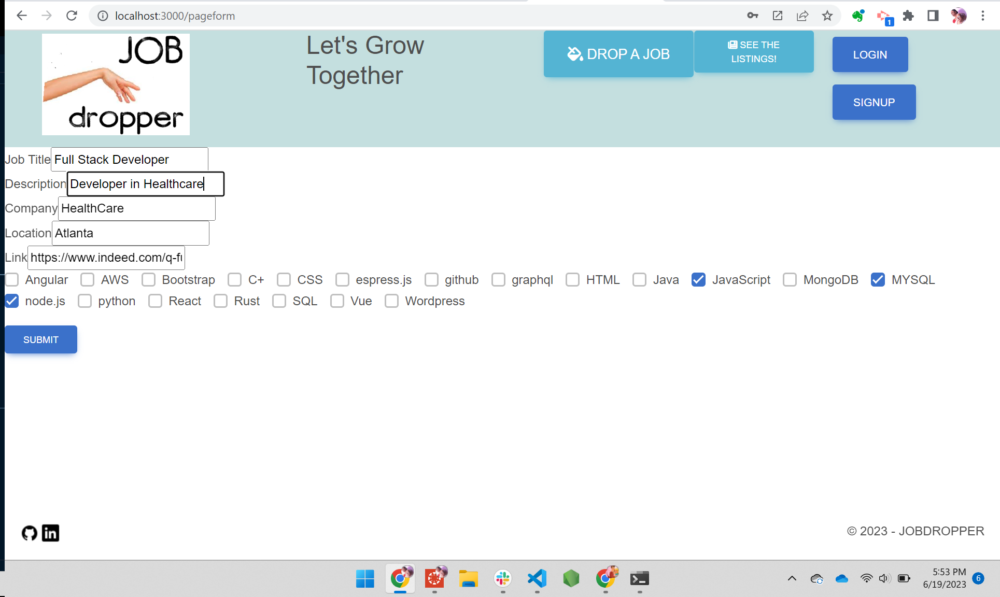
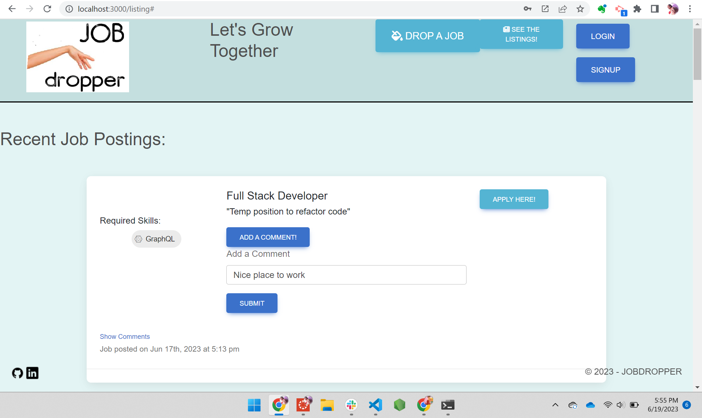

# JOB-DROPPER

## Description

Job Dropper is a site for people who want to help their friends. For job seekers to see curated lists of jobs shared by buddies.Because all other social networking sites are too formal and take too long, require too much information and are too focused on attracting business interests and not just serving the public and the social needs of those looking for jobs. We want to make job search social in a way it hasn't been done before. 

  
  
  
  
  
  
  
  
  
  

## Installation

In the project directory, you can run:

### `npm run dev` 
starts both the client and server.

Runs the app in the development mode.\
Open [http://localhost:3000](http://localhost:3000) to view it in your browser.
The page will reload when you make changes.

Scripts are placed in the root and client directory's `package.json`.
* `npm run start` runs the `build` script and starts the server.
* `npm run server` starts just the server and not the client.
* `npm run build` runs the webpack build script in the client.
* `npm run install` installs the dependencies for the client.
* `npm run client` starts the client without the server.

## Contributors

* [Dustin Swecker](https://github.com/DustinSwecker)
* [Meghan Simmons](https://github.com/meghansimmons)
* [Reshma Paul](https://github.com/reshmalijo777)
* [Chelsea Curry](https://github.com/ccurrystar9186)

## Screenshots

## Check out our work following the Links:

* [Job Dropper Website](https://job-dropper.herokuapp.com/)
* [Github Repository](https://github.com/DustinSwecker/job-dropper)
